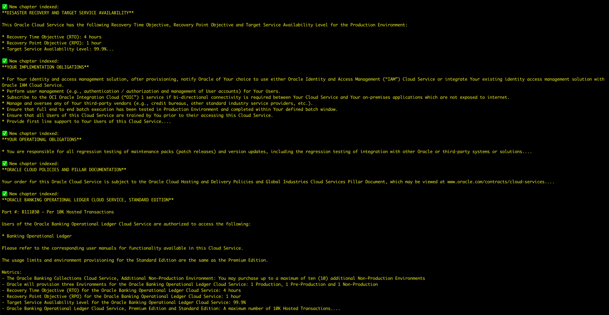
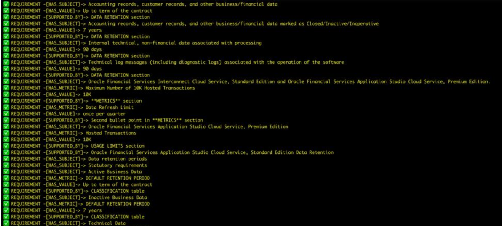
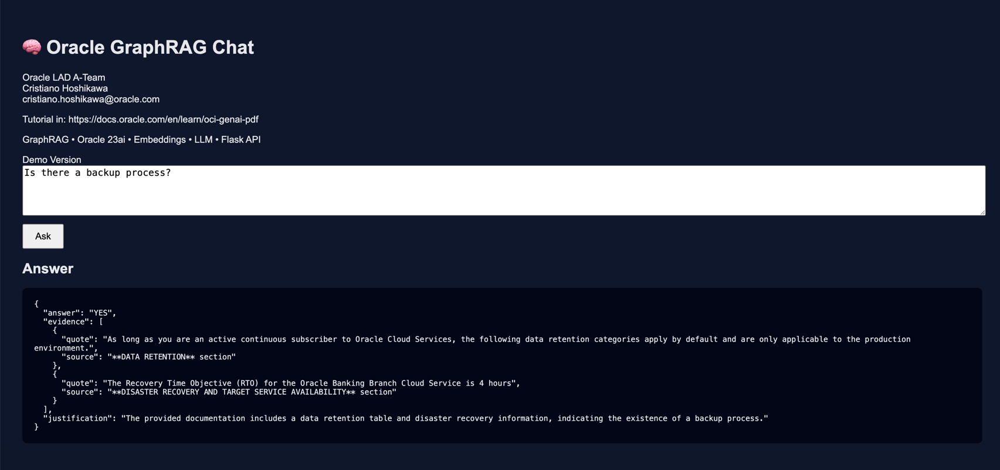

# 🧠 Oracle GraphRAG for RFP Validation

**GraphRAG-based AI system for factual RFP requirement validation using Oracle 23ai, OCI Generative AI, and Vector Search**

---

## 📌 Overview

This project implements an **AI-driven RFP validation engine** designed to answer *formal RFP requirements* using **explicit, verifiable evidence** extracted from technical documentation.

Instead of responding to open-ended conceptual questions, the system evaluates **whether a requirement is met**, returning **YES / NO / PARTIAL**, along with **exact textual evidence** and full traceability.

The solution combines:

- Retrieval-Augmented Generation (RAG) over PDFs
- GraphRAG for structured factual relationships
- Oracle 23ai Property Graph + Oracle Text
- OCI Generative AI (LLMs & Embeddings)
- FAISS vector search
- Flask REST API

This project is based on the article: [Analyze PDF Documents in Natural Language with OCI Generative AI](https://docs.oracle.com/en/learn/oci-genai-pdf)

See the details about this material to setup/configure your development environment, Oracle Autonomous Database AI and other components.


---

## 🎯 Why RFP-Centric (and not Concept Q&A)

While typical knowledge base projects focus on extracting information about concepts, step-by-step instructions, and numerous answers to questions asked about a particular subject, an RFP requires a very special approach.

>**Note:** Traditional RAG systems are optimized for *conceptual explanations*. RFPs require **objective validation**, not interpretation.

This project shifts the AI role from:

❌ *“Explain how the product works”*  
to  
✅ *“Prove whether this requirement is met, partially met, or not met”*

---

## 🧩 Core Capabilities

### ✅ RFP Requirement Parsing

Each question is parsed into a structured requirement:

```json
{
  "requirement_type": "COMPLIANCE | FUNCTIONAL | NON_FUNCTIONAL",
  "subject": "authentication",
  "expected_value": "MFA",
  "decision_type": "YES_NO | YES_NO_PARTIAL",
  "keywords": ["authentication", "mfa", "identity"]
}
```

---

### 🧠 Knowledge Graph (GraphRAG)

Facts are extracted **only when explicitly stated** in documentation and stored as graph triples:

```
REQUIREMENT -[HAS_METRIC]-> messages per hour
REQUIREMENT -[HAS_VALUE]-> < 1 hour
REQUIREMENT -[SUPPORTED_BY]-> Document section
```

There are three types of information:
- What metric: HAS_METRIC 
- Value of metric: HAS_VALUE
- Font of information: SUPPORTED_BY

This ensures:
- No hallucination
- No inferred assumptions
- Full auditability

---

### 🔎 Hybrid Retrieval Strategy

1. **Vector Search (FAISS)**
2. **Oracle Graph + Oracle Text**
3. **Graph-aware Re-ranking**

---

### 📊 Deterministic RFP Decision Output

```json
{
  "answer": "YES | NO | PARTIAL",
  "justification": "Short factual explanation",
  "evidence": [
    {
      "quote": "Exact text from the document",
      "source": "Document or section"
    }
  ]
}
```

---

## 🏗️ Architecture

```
PDFs
 └─► Semantic Chunking
     └─► FAISS Vector Index
         └─► RAG Retrieval
             └─► GraphRAG (Oracle 23ai)
                 └─► Evidence-based LLM Decision
                     └─► REST API Response
```

---

## 🚀 REST API

### Health Check
GET /health

### RFP Validation
POST /chat

```json
{
  "question": "Does the platform support MFA and integration with corporate identity providers?"
}
```

---

## 🧪 Example Use Cases

- Enterprise RFP / RFQ validation
- Pre-sales technical due diligence
- Compliance checks
- SaaS capability assessment
- Audit-ready AI answers

---

## 🛠️ Technology Stack

- Oracle Autonomous Database 23ai
- OCI Generative AI
- LangChain / LangGraph
- FAISS
- Flask
- Python

---

## 🔐 Design Principles

- Evidence-first
- Deterministic outputs
- No hallucination tolerance
- Explainability

---

# GraphRAG for RFP Validation – Code Walkthrough

> **Status:** Demo / Reference Implementation  
> **Derived from:** Official Oracle Generative AI & GraphRAG learning material  
> https://docs.oracle.com/en/learn/oci-genai-pdf

---

## 🎯 Purpose of This Code

This code implements a **GraphRAG-based pipeline focused on RFP (Request for Proposal) validation**, not generic Q&A.

>**Download** the code [graphrag_rerank.py](./files/graphrag_rerank.py)

The main goal is to:
- Extract **explicit, verifiable facts** from large PDF contracts and datasheets
- Store those facts as **structured graph relationships**
- Answer RFP questions using **YES / NO / PARTIAL** decisions
- Always provide **document-backed evidence**, never hallucinations

This represents a **strategic shift** from concept-based LLM answers to **compliance-grade validation**.

---

## 🧠 High-Level Architecture

1. **PDF Ingestion**
    - PDFs are read using OCR-aware loaders
    - Large documents are split into semantic chunks

2. **Semantic Chunking (LLM-driven)**
    - Headings, tables, metrics, and sections are normalized
    - Output is optimized for both vector search and fact extraction



3. **Vector Index (FAISS)**
    - Chunks are embedded using OCI Cohere multilingual embeddings
    - Enables semantic recall

4. **Knowledge Graph (Oracle 23ai)**
    - Explicit facts are extracted as triples:
        - `REQUIREMENT -[HAS_METRIC]-> RTO`
        - `REQUIREMENT -[HAS_VALUE]-> 1 hour`
    - Stored in Oracle Property Graph tables



5. **RFP Requirement Parsing**
    - Each user question is converted into a structured requirement:
      ```json
      {
        "requirement_type": "NON_FUNCTIONAL",
        "subject": "authentication",
        "expected_value": "",
        "keywords": ["mfa", "ldap", "sso"]
      }
      ```

6. **Graph + Vector Fusion**
    - Graph terms reinforce document reranking
    - Ensures high-precision evidence retrieval

7. **Deterministic RFP Decision**
    - LLM outputs are constrained to:
        - `YES`
        - `NO`
        - `PARTIAL`
    - Always backed by quotes from source documents

---

## 🗂️ Key Code Sections Explained

### Oracle Autonomous & Graph Setup
- Creates entity and relation tables if not present
- Builds an Oracle **PROPERTY GRAPH**
- Uses Oracle Text indexes for semantic filtering

### `create_knowledge_graph()`
- Uses LLM to extract **ONLY explicit facts**
- No inference, no assumptions
- Inserts entities and relations safely using MERGE

### `parse_rfp_requirement()`
- Converts free-text questions into structured RFP requirements
- Enforces strict JSON output using `<json>` tags
- Includes safe fallback logic

### `query_knowledge_graph()`
- Uses Oracle Text (`CONTAINS`) with sanitized queries
- Filters graph facts by RFP keywords
- Returns only relevant evidence

### Graph-aware Re-ranking
- Combines:
    - Vector similarity
    - Graph-derived terms
- Improves precision on contractual questions

### Final RFP Decision Chain
- Implemented with LangChain `RunnableMap`
- Clean separation of:
    - Requirement parsing
    - Context retrieval
    - Decision generation

---

## ✅ Why This Is NOT a Generic RAG

| Traditional RAG | This GraphRAG |
|----------------|---------------|
| Answers concepts | Validates requirements |
| May hallucinate | Evidence-only |
| Free-form text | Deterministic YES/NO |
| No structure | Knowledge graph |
| Chatbot | RFP analyst |

---
## Test the Application

FIrst of all, you need to run the code to prepare the Vector and Graph database. Run this one time only or, if you changed the PDF file with new content, erase the faiss_index folder and change de GRAPH_NAME variable on the code and run it again.

    python graphrag_rerank.py


After the execution, the code will chat with you to test. You can give some questions like:

### 🔐 Security & Compliance
1.	How is data protected both in transit and at rest, considering the service is accessed over the internet?
2.	Is the SaaS service certified under recognized security standards (ISO 27001, SOC 2, PCI DSS, etc.)?
3.	Does the solution use a multi-tenant architecture, and how is data isolation between customers ensured?
4.	How are privileged and administrative accesses managed and controlled?
5.	Are periodic penetration tests conducted? If so, how frequently?
6.	Does the platform support strong authentication mechanisms such as MFA and integration with corporate identity providers (LDAP, Active Directory, SSO/IdP)?

⸻

### 🌐 Internet Dependency & Availability
7.	Does the solution provide any offline capabilities or contingency mechanisms in case of internet unavailability?
8.	What is the guaranteed service availability SLA and how is it measured?
9.	How does the system perform under high network latency or unstable connectivity conditions?
10.	Is geographic redundancy implemented to mitigate regional outages?

⸻

### ⚡ Performance & Scalability
11.	How is performance maintained during peak usage periods with multiple concurrent customers?
12.	Are there technical limits on concurrent users, transactions, or data volume?
13.	Can customers monitor performance and resource consumption metrics in real time?
14.	Does the platform scale automatically under increased load, or is manual intervention required?

⸻

### 📦 Technical & Contractual Limitations
15.	Are there defined limits on storage, transactions, API usage, or integrations?
16.	What happens if contractual limits are exceeded — throttling, additional charges, or service suspension?
17.	Are there restrictions on customization due to the SaaS delivery model?
18.	Can on-premises or legacy systems be integrated with the SaaS solution, and what limitations apply?

⸻

### 🔄 Business Continuity, Backup & Recovery
19.	How frequently are backups performed, and where are they stored?
20.	What Recovery Time Objective (RTO) and Recovery Point Objective (RPO) are guaranteed in case of a major incident?
21.	Is granular data restoration supported at the customer level?

⸻

### 🚪 Vendor Lock-in & Data Ownership
22.	How can customers retrieve their data upon contract termination?
23.	Is customer data provided in open, documented formats?
24.	Does the solution rely on proprietary technologies that may complicate future migration?

⸻

### 🧑‍⚖️ Governance, Auditability & Transparency
25.	Does the platform provide comprehensive audit logs for user and system activities?
26.	How are security incidents communicated to customers?
27.	Is there a defined SLA for incident response and resolution?

⸻

You can run a web desginer UI. Just put the [app.py](./files/app.py) on the same folder of your [graphrag_rerank.py](./files/graphrag_rerank.py), create a **templates** folder on the same folder and put the [index.html](./files/index.html) file inside this folder.

```
root
 └─► graphrag_rerank.py
 └─► app.py
 └─► templates
     └─► index.html
```

     python app.py

Call the http://localhost:8100 in your browser.



There is also a REST Service implemented in the code, so you can automatize a RFP list calling item by item and obtain the responses you want: YES/NO

    curl -X POST http://localhost:8100/chat \
    -H "Content-Type: application/json" \
    -d '{"question": "What is the RTO of Oracle Application?"}'

---

## ⚠️ Important Design Principles

- **Evidence-first**: If not explicitly stated → NO
- **No inference**: LLM is forbidden to assume
- **Auditability**: Every answer is traceable
- **Enterprise-grade**: Designed for legal, procurement, compliance

---

## 📌 Intended Use Cases

- RFP response automation
- Vendor compliance validation
- Contractual due diligence
- Pre-sales technical qualification
- Regulatory checks

---

## 🧪 Demo Disclaimer

This code is:
- A **demo / reference implementation**
- Not production-hardened
- Intended for education, experimentation, and architecture discussions

---

## 👤 Acknowledgments

- **Author** - Cristiano Hoshikawa (Oracle LAD A-Team Solution Engineer)

---

## 📎 References

[Analyze PDF Documents in Natural Language with OCI Generative AI](https://docs.oracle.com/en/learn/oci-genai-pdf)

---

## ⚠️ Disclaimer

This is a demo / reference architecture.  
Final answers depend strictly on indexed documentation.

